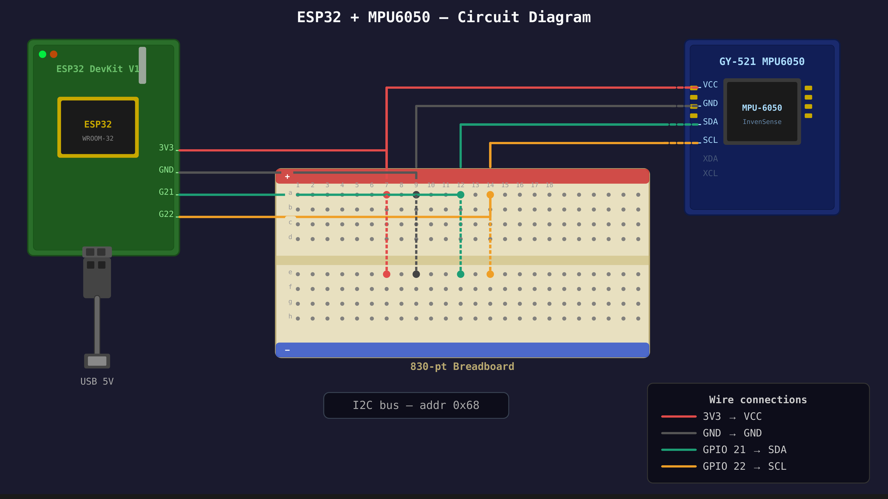

# smart-fall-detection-system
ESP32-based fall detection system using MPU6050 accelerometer with Telegram alerts
🧪 This is a mini project — built for learning and hands-on practice with ESP32, sensors, and IoT logic.
# 🚨 Smart Fall Detection System

> An ESP32-based safety system that automatically detects falls in elderly individuals using an MPU6050 accelerometer and instantly alerts family members via Telegram — no action needed from the victim.


---

## 🧩 Problem Statement

Elderly individuals are at high risk of falling due to age-related issues such as weak muscles, poor balance, and dizziness. When a fall occurs at home with no one nearby, the person may be unable to call for help. Family members away from home have no way of knowing unless the person responds. This project automates fall detection and alerting, removing the need for the victim to take any action.

---

## ⚙️ Working Principle

1. The MPU6050 sensor continuously monitors acceleration on all 3 axes
2. The ESP32 calculates the overall acceleration magnitude: `√(ax² + ay² + az²)`
3. If magnitude suddenly exceeds **3g**, it flags a possible fall and starts a 5-second timer
4. After 5 seconds, it checks again — if magnitude has dropped below **1.2g**, it confirms the person is lying still → real fall confirmed
5. A Telegram alert is instantly sent to the family member's phone
6. The system resets and resumes continuous monitoring

---

## 🔌 Circuit Diagram



| Connection | ESP32 Pin |
|-----------|-----------|
| VCC | 3V3 |
| GND | GND |
| SDA | GPIO 21 |
| SCL | GPIO 22 |

I2C address: `0x68`

---

## 🛠️ Components Used

| Component | Function | Price (₹) |
|-----------|----------|-----------|
| ESP32 DevKit V1 | Main microcontroller + Wi-Fi | 1,000 |
| MPU6050 (GY-521 module) | Accelerometer + gyroscope | 300 |
| Breadboard (830 points) | Circuit prototyping | 85 |
| Jumper wires | SDA/SCL/VCC/GND connections | 70 |
| Micro USB cable | Power supply & programming | 60 |
| **Total** | | **₹1,515** |

---

## ✨ Features

- Real-time fall detection using accelerometer magnitude analysis
- Automatic Telegram alerts — no manual action required
- False-alarm filtering via the 5-second stillness confirmation step
- Continuous 24/7 monitoring
- Low-cost build (~₹1,515)

---

## ✅ Advantages

- **Automatic detection** — no need to press a button or call for help
- **Real-time alert** — Telegram message sent instantly on confirmed fall
- **Low cost** — built with affordable components
- **Continuous monitoring** — works 24/7 without supervision

## ⚠️ Limitations

- **Wi-Fi dependency** — requires stable internet to send alerts
- **False positives** — sudden movements (sitting quickly, bending) may occasionally be misread
- **No visual confirmation** — only sends a text alert, no video feed
- **Battery life** — continuous monitoring consumes significant power

## 🔮 Future Improvements

- AI-based fall detection to reduce false alarms
- Camera integration for live video confirmation
- GPS tracking for outdoor use
- Dedicated mobile app for alerts and settings

---

## 🚀 How to Set Up

1. Clone this repo
```bash
git clone https://github.com/tamizh-mr/smart-fall-detection-system
```

2. Install required library in Arduino IDE: **Adafruit MPU6050** (Tools → Manage Libraries)

3. Open `smart_fall_detection_system.ino`

4. Edit these lines with your own credentials:
```cpp
const char* WIFI_SSID     = "YOUR_WIFI_NAME";
const char* WIFI_PASSWORD = "YOUR_WIFI_PASSWORD";
const char* BOT_TOKEN = "YOUR_BOT_TOKEN";
const char* CHAT_ID   = "YOUR_CHAT_ID";
```

5. Wire the circuit as shown above

6. Upload to ESP32 and power on ✅

---

## 👤 Author

**Tamilmurugan M R**
- GitHub: [@tamizh-mr](https://github.com/tamizh-mr)

---

*Built with ESP32 + MPU6050 + Telegram Bot API*
